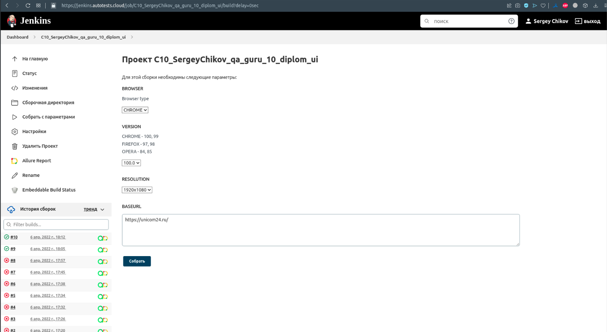

# Проект автотестов на сайт Unicom24.ru

Использованны слудующие технологии:

<p align="center">


</p>

# Запуск тестов
Запуск осуществляется командой: 
```
gradle clean test
```
Для запуска тестов в Jenkins используется следующая команда:
```
clean
test
-Dbrowser=${BROWSER}
-Dversion=${VERSION}
```
где:

`${BROWSER}` - тип браузера для тестов, 

`${VERSION}` - версия браузера.

# Запуск тестов в Jenkins выглядит следующим образом
Главная страница сборки


Выбор параметров сборки


Работа сборки


Отчет о выполнении тестов


Каждый тест, независимо от результата, состоит из:
- начальных параметров,
- шагов, 
- скриншота браузера,
- исходного кода страницы,
- лога консоли браузера,
- видео выполнения теста.


По резултатам работы тестов отправляется краткий отчет в Telegram


# Пример прохождения теста на удаленной машине


