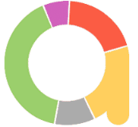
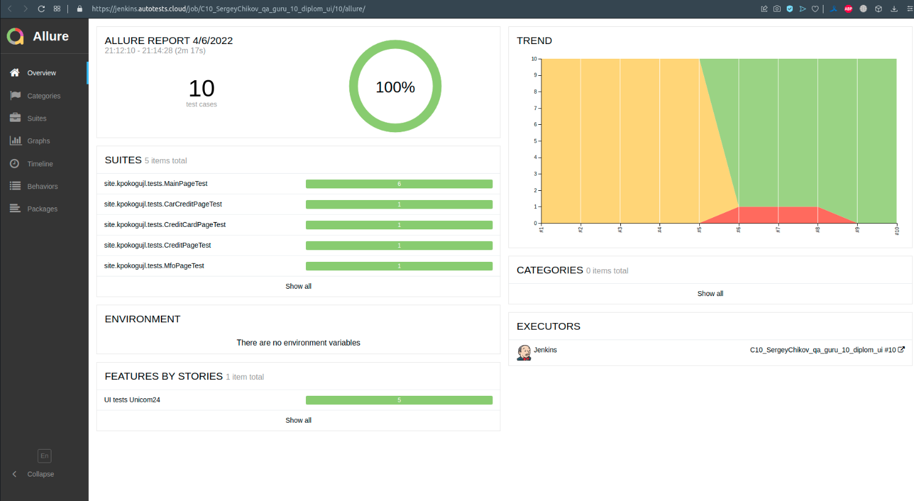
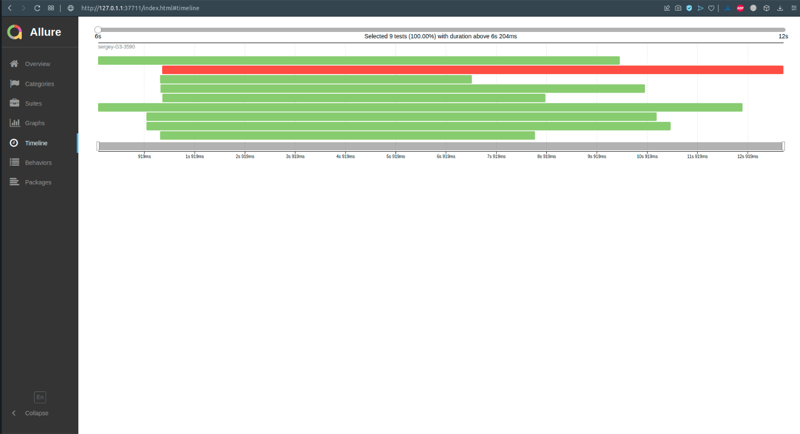

# Проект автотестов на сайт Unicom24.ru
Проект создан в рамках обучения в школе QA.GURU и представляет из себя часть выпускной работы.

<a name="оглавление"></a>
# Оглавление
1. [Технологии](#технологии)
2. [Описание проекта](#описание)
3. [Запуск тестов](#запуск)
    1. [Запуск тестов локально](#запуск)
    2. [Запуск тестов в Jenkins](#запуск_дженкинс)
4. [Результаты работы тестов](#видео)
    1. [Пример работы тестов (видео)](#видео)
    2. [Результаты тестов в телеграм](#телеграм)
5. [Allure TestOps](#проект)
    1. [Проект](#проект)
    2. [Интеграция с Jenkins](#интеграция)
    3. [Dashboard](#дашборд)

<a name="технологии"></a>
# Использованны слудующие технологии:
<p align="center">



</p>

[К оглавлению ⬆](#оглавление)
<a name="описание"></a>
# Описание проекта
Автоматизирована проверка главной страницы сайта unicom24.ru. Использован паттерн проектирования
автотестов PageObject. Каждая страница описана отдельным классом.

[К оглавлению ⬆](#оглавление)
<a name="запуск"></a>
# Запуск тестов
Запуск осуществляется командой: 
```
gradle clean test
```
Для запуска тестов в Jenkins используется следующая команда:
```
clean
test
-Dbrowser=${BROWSER}
-Dversion=${VERSION}
-Dresolution=${RESOLUTION}
-DbaseUrl=${BASEURL}
```
Где:

`${BROWSER}` - тип браузера для тестов, 

`${VERSION}` - версия браузера.

`${RESOLUTION}` - разрешение экрана

`${BASEURL}` - url сайта для теста (прменяется для прогона тестов на разном окружении)

[К оглавлению ⬆](#оглавление)
<a name="запуск_дженкинс"></a>
# Запуск тестов в Jenkins выглядит следующим образом
Главная страница сборки


Выбор параметров сборки


Работа сборки


Отчет о выполнении тестов


Каждый тест, независимо от результата, состоит из:
- начальных параметров,
- шагов, 
- скриншота браузера,
- исходного кода страницы,
- лога консоли браузера,
- видео выполнения теста.


Тесты запускаются в многопоточном режиме


[К оглавлению ⬆](#оглавление)
<a name="видео"></a>
# Пример прохождения теста на удаленной машине


[К оглавлению ⬆](#оглавление)
<a name="телеграм"></a>
# По результатам работы тестов отправляется краткий отчет в Telegram


[К оглавлению ⬆](#оглавление)
<a name="проект"></a>
# Создан проект в Allure TestOps
Тесты в проекте импортированы из кода, то есть не приходится писать тесты и автоматизировать их.
Достаточно написать автотест, а кейс в TMS всегда будет в актуальном состоянии. Так же, на проекте есть ручные тесты.


[К оглавлению ⬆](#оглавление)
<a name="интеграция"></a>
# Настроена интеграция Jenkins и Allure TestOps
Запуск джоб осуществляется из интерфейса Allure TestOps


Результаты работы джоб также отображаются в Allure TestOps


[К оглавлению ⬆](#оглавление)
<a name="дашборд"></a>
# Настроен Dashboard с разными показателями
Отображаются графики тренда автоматизации, последний запуск и т.д.


[К оглавлению ⬆](#оглавление)